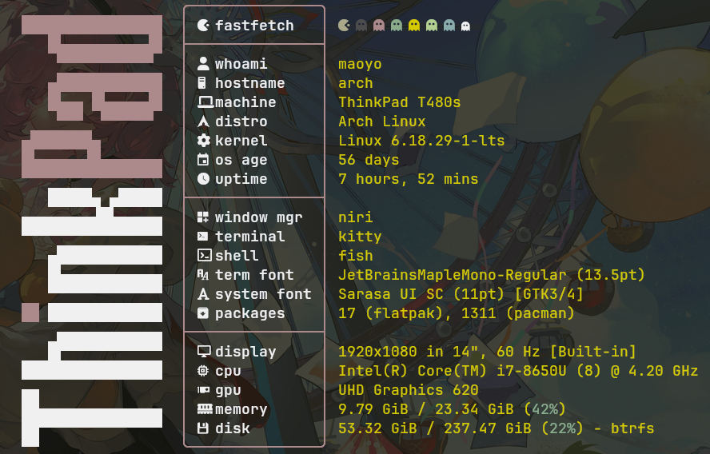

# ThinkPad-fastfetch

[](LICENSE)
[](https://github.com/fastfetch-cli/fastfetch)

A **ThinkPad-inspired** fastfetch configuration with the classic **V-shaped ASCII logo** and **TrackPoint red dot**, framed in a ThinkPad-accented info panel.

Designed for the ThinkPad T480s — works on any ThinkPad.

## Preview



> Terminal output showing the V-shaped ThinkPad logo with TrackPoint red dot alongside a framed system info panel. Red box borders (`#e32636`) with golden output values (`#d6ca00`) and a rainbow title decoration.

<details>
<summary>Text-only preview (for readers without images)</summary>

```
████████████████                ╭──────────────────────╮
    █▙▄▄▄▄▄▄▄▄▄▟█               │  󰮯 fastfetch  󰊠 󰊠 󰊠 󰊠 󰊠 󰊠 󰊠 │
     ▀▀▀▀▀▀▀▀▀▀▀                 ├──────────────────────┤
    ▄████████████                 │   whoami      maoyo │
    █▙▄▄ █▙▄▄▄▄▟█              │  󰇅 hostname    arch │
     ▀▀▀  ▀▀▀▀▀▀                 │   machine     ThinkPad T480s │
 ▄███████▄                        │  󰣇 distro      Arch Linux │
 █▙▄▄▄▄▄▟█▄▄▄▄▄▄▄              │   kernel      6.18.29-1-lts │
 ▀▀▀▀▀▀▀▀▀▀▀▀▀▀▀▀              │  󰃭 os age      56 days │
    █████▄ ▄█████                 │  󰥔 uptime      7h 47m │
 ▄▄▄▄▄▄▄▄▟█▙▄▄▄▄▄              ├──────────────────────┤
 ▀▀▀▀▀▀▀▀▀▀▀▀▀▀▀▀              │  󰾍 window mgr  niri │
    ▄████████████                 │   terminal    kitty │
    █▙▄▄▄▄▄▄▄▄▄▄▄              │   shell       fish │
    ▀▀▀▀▀▀▀▀▀▀▀▀▀              │  󰛖 term font   JetBrainsMono │
██ █████████████                 │   font        Sarasa UI SC │
    ▄▄▄▄▄▄▄▄▄▄▄▄               │  󰏔 packages    1311 (pacman) │
   █▛▀▀▀▀▀▀▀▀▀▀▀               ├──────────────────────┤
████████████████                 │  󰍹 display     1920×1080 @ 60Hz │
▄▄                               │  󰍛 cpu         i7-8650U (8) @ 4.20GHz │
██▄▄▄▄▄▄▄▄▄▄▄▄▄▄               │  󰢮 gpu         UHD Graphics 620 │
██▀▀▀▀▀▀▀▀▀▀▀▀▀▀               │   memory      9.82 / 23.34 GiB │
▀▀                               │  󰉉 disk        53.30 / 237.47 GiB │
                                 ╰──────────────────────╯
```

</details>

## Installation

```bash
# 1. Clone the repo
git clone https://github.com/MaoYo42/ThinkPad-fastfetch.git ~/ThinkPad-fastfetch

# 2. Copy config to fastfetch directory
cp -r ~/ThinkPad-fastfetch/config.jsonc ~/.config/fastfetch/
cp -r ~/ThinkPad-fastfetch/thinkpad-v.txt ~/.config/fastfetch/

# 3. Run it
fastfetch
```

### Verify

If everything is set up correctly, you should see the V-shaped ThinkPad logo alongside a framed system info panel with red accents and golden output values.

## Features

| Element | Detail |
|---------|--------|
| **Logo** | Classic ThinkPad V-shaped ASCII with red TrackPoint dot (two `██` chars) |
| **Frame** | ThinkPad red (`#e32636`) box borders — `╭─╮├─┤╰─╯` |
| **Values** | Golden `#d6ca00` output for all data fields |
| **Title** | Rainbow-colored "fastfetch" header with `󰮯 󰊠 󰊠 ...` decoration |
| **Info** | OS, kernel, uptime, os age, WM, terminal, shell, fonts, packages, display, CPU, GPU, memory, disk |

## Files

```
~/.config/fastfetch/
├── config.jsonc       # fastfetch configuration (JSON with comments)
└── thinkpad-v.txt     # ThinkPad V-shaped ASCII logo art
```

## Credits

- Original ThinkPad V logo design by [trekkie-dev](https://codeberg.org/trekkie-dev/fastfetch) on Codeberg
- Red-framed layout inspired by the same design

## License

MIT
